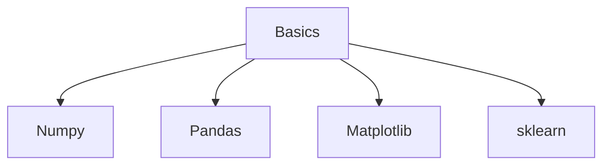
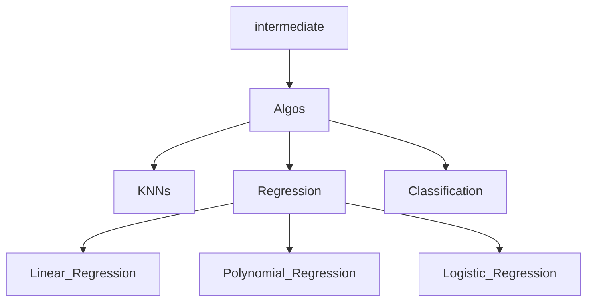

### Hello,

## Welcome to the " Machine Learning & Data Science with Python, Kaggle & Pandas " Jupyter Notebooks

> [!IMPORTANT]
> Machine Learning A-Z course from zero with Python, Kaggle, Pandas and Numpy for data analysis with hands-on Jupyter Notebooks

Machine learning is a branch of artificial intelligence (AI) and computer science which focuses on the use of data and algorithms to imitate the way that humans learn, gradually improving its accuracy.

You can develop the foundational skills you need to advance to building neural networks and creating more complex functions through the Python and R programming languages. Machine learning helps you stay ahead of new trends, technologies, and applications in this field.

